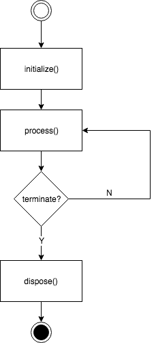

Swarm
=============
*An elegant Java client for Locust*


#### 1. Motivation

IMHO, [Locust4j](https://github.com/myzhan/locust4j) a basic implementation for Locust clients written in Java. It has so many restrictions, including:

- The code base is not organized well

- Not so performant with blocking queues

- `AbstractTask` does NOT support async operations

- Slow start-up time (mostly by `Utils.getNodeID()`)

- Insufficient usage of threading. `Locust4j` will use `N` threads to stimulate `N` users. A big `N` will result in performance degradation (due to context switching of threads)

- Not well-supported for async operations

Based on implementation of `Locust4j`, `Swarm` is completely re-written to address all issues above, with some additional features:

- Auto detect connection status to Locust master hosts and reponse back.

- A better model to stimulate concurrent users (with disruptors)


#### 2. Implementation

- `LMAX Disruptor` for non-blocking queues

- `Google Guava` for rate limiting

- `Jeromq` + `MessagePack`  for working with Locust masters

#### 3. Installation

Before using `Swarm`, you must declare it as a dependency of your Maven project. For example:

```
<dependency>
    <groupId>com.bigsonata.swarm</groupId>
    <artifactId>locust-swarm</artifactId>
    <version>1.1.5</version>
</dependency>
```

You also have to add following dependencies:

```
<dependency>
    <groupId>ch.qos.logback</groupId>
    <artifactId>logback-classic</artifactId>
    <version>1.2.3</version>
</dependency>

<dependency>
    <groupId>ch.qos.logback</groupId>
    <artifactId>logback-core</artifactId>
    <version>1.2.3</version>
</dependency>

<dependency>
    <groupId>org.msgpack</groupId>
    <artifactId>msgpack-core</artifactId>
    <version>0.8.13</version>
</dependency>

<dependency>
    <groupId>org.zeromq</groupId>
    <artifactId>jeromq</artifactId>
    <version>0.4.3</version>
</dependency>

<dependency>
    <groupId>com.lmax</groupId>
    <artifactId>disruptor</artifactId>
    <version>3.3.7</version>
</dependency>

<!-- https://mvnrepository.com/artifact/com.google.guava/guava -->
<dependency>
    <groupId>com.google.guava</groupId>
    <artifactId>guava</artifactId>
    <version>23.0</version>
</dependency>
```

#### 4. How to write your benchmarks

##### 4.1 Overview

`Swarm` uses the term of `Cron` to refer to repeating tasks defined by you. 

Life cycle of a Cron-based instance can be described in the following diagram:



`Swarm` is responsible for cloning, initializing crons. 

##### 4.2 Cron anatomy


```java
// Here is an abridged version of class Cron
public abstract class Cron implements Cloneable, Runnable {
    public Cron(Props props) {
        this.props = props;
    }

    public abstract void process();

    public abstract Cron clone();

    public void recordFailure(long responseTime, String error) {
        // ..
    }

    public void recordSuccess(long responseTime, long contentLength) {
        // ..
    }

    public void recordSuccess(long responseTime) {
        // ..
    }

    @Override
    public void run() {
        // ...
        process();
    }

    public abstract void dispose();

    public abstract void initialize();
}

```

Each cron has its own `props` which defines type & name (to display on the Web interface):


```java
public class Props {
    protected String type = "default";
    protected String name = "cron";
    protected int weight = 1;
    protected boolean async = false;

    public static Props create() {
        return new Props();
    }

    public static Props createAsync() {
        return new Props()
                .setAsync(true);
    }


    public Props setType(String type) {
        // ..
    }

    public Props setName(String name) {
        // ..
    }

    public Props setWeight(int weight) {
        // ..
    }

    public Props setAsync(boolean async) {
        // ..
    }
}
```

`NOTE:` A cron must specify how it works: synchronously or asynchronously

Inside each cron, there are 4 must-overridden methods
- `clone`: you should let `Swarm` know how to clone your Cron :D
- `initialize` : It's a great place for you to initiate connections (if you want to use pooling mechanism)
- `process`: which is repeatedly executed to perform your tests and report results
- `dispose`: Swarm will invoke this method to dispose any resources allocated by crons

##### 4.3 Define your crons

You need to define your loading test by deriving class `Cron`:

For example, in our `AsyncCron`:

```java
public class TimerCron extends Cron {
  public TimerCron() {
    super(Props.create().setName("timer").setAsync(false));
  }

  @Override
  public void process() {
    try {
      System.out.println("> Processing...");
      long start = System.currentTimeMillis();
      Thread.sleep(1000);
      long duration = System.currentTimeMillis() - start;
      recordSuccess(duration);
    } catch (InterruptedException e) {
      e.printStackTrace();
    }
  }

  @Override
  public Cron clone() {
    return new TimerCron();
  }

  @Override
  public void dispose() {}

  @Override
  public void initialize() {}
}
```

##### 4.4 Finalize

After defining your crons, finally you need to instruct `Swarm` to start: 

```java
Locust.Builder.newInstance()
    .setMasterHost(masterHost)
    .setMasterPort(masterPort)

    // Optionally set the interval (in ms) to report statistics
    // Default: 2000
    .setStatInterval(2000)

    // Optionally set a seed number to generate nodeId
    .setRandomSeed(0)

    // Optionally set the number of threads to stimulate Crons
    // Default: 8
    .setThreads(8)

    // Optionally set the number of maximum requests per second
    .setMaxRps(1000)

    // Register cron tasks
    .setCrons(new TimerCron());
    .build()
```

#### 5. Tips

- To effectively benchmark with Locust, we may need to use `connection pooling`

- See the demo in `src/main/java/com.bigsonata/example`


#### 6. Contributions

If you find anything wrong or would like to contribute in any way, feel free to create a pull request/open an issue/send me a message. Any comments are welcome!

<a href="https://github.com/anhldbk/swarm/graphs/contributors">
  
</a>

#### 7. History

**v1.1.6**
- Released in 26/03/2023
- Fixed a compatibility issue with Locust 2.x. Thank you [jayudey-wf](https://github.com/jayudey-wf) for his [PR](https://github.com/anhldbk/swarm/pull/27)


**v1.1.5**
- Released in 22/10/2021
- Fixed a compatibility issue with Locust on recoding `Occurrences` (with this [PR](https://github.com/anhldbk/swarm/pull/25))


**v1.1.4**
- Released in 30/05/2020
- Fixed a compatibility issue with Locust v0.14.6 (reported [here](https://github.com/anhldbk/swarm/issues/19))

**v1.1.3**
- Released in 26/02/2020
- Fixed a compatibility issue with Locust v0.14.4. Thank you [gungjodi](https://github.com/gungjodi) for his [PR](https://github.com/anhldbk/swarm/pull/12)

**v1.1.0**
- Released in 29/12/2019
- Fixed a compatibility issue wit Locust with version > v0.10.0. Thank you [BogdanLivadariu](https://github.com/BogdanLivadariu) for suggesting solutions.
- Locust Builder to include `setCrons`
- Refactored code & documentation

**v1.0.1**
- Released in 10/10/2018
- Increased the internal buffer size to 32k (which effectively affect our Crons' througput)

**v1.0.0**
- Released in 13/08/2018
- Simplified APIs
- Used a better mechanism for scheduling crons. This mechanism effectively stimulates hatching users gradually

**v0.1.2**
- Released in 27/06/2018
- Fixed a bug in processing hatch rates (PR by [@HughZurname](https://github.com/HughZurname))
- Allowed  Locust to specify the maximum requests per second (PR by [@jaymoid](https://github.com/jaymoid))

**v0.1.0**
- Released in 26/05/2018
- Initial release

